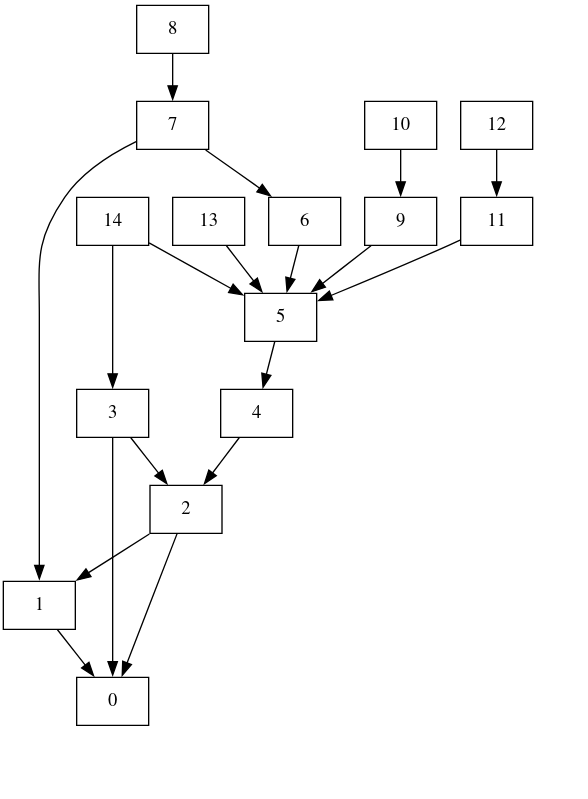

# Hiboux graphes

<p align="center">
    
</p>

<p align="center">
    <b>Conversations avec nos amis les hiboux</b>
</p>

<p align="center">
    <a target="_blank" href="https://fr.wikipedia.org/wiki/Hibou"></a>
    <a target="_blank" href="https://ocaml.xyz/"></a>
</p>

# Installation
```shell
opam install owl ocamlgraph odoc ounit2 core_unix cohttp-lwt-unix lwt yojson
```

# Visualisation
## Graphvizzz
Using the `graph_to_dot` function provided in the module `Aigle`: 



## Neo4j
Using the pawar of Neo4j:


