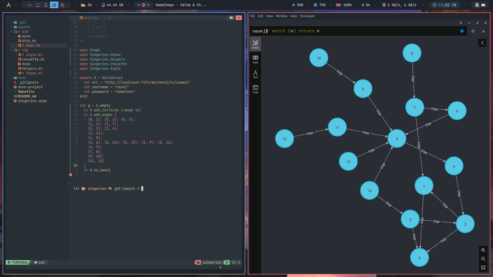

# Hiboux graphes

<p align="center">
    
</p>

<p align="center">
    <b>Conversations avec nos amis les hiboux</b>
</p>

<p align="center">
    <a target="_blank" href="https://fr.wikipedia.org/wiki/Hibou"></a>
    <a target="_blank" href="https://ocaml.xyz/"></a>
</p>

# Installation
```shell
opam install owl ocamlgraph odoc ounit2 core_unix cohttp-lwt-unix lwt yojson
```

# Visualisation
## Graphvizzz
Using the `graph_to_dot` function provided in the module `Aigle`: 


## Neo4j
Using the pawar of Neo4j:



# OCamlTorch
## Micrograd (from Andrej Karpathy <3)
Implementation of Micrograd in OCaml, with this snippet: 
```ocaml 
open Ocamltorch.Backprop.Value

let x1 = make_value ~label:"x1" 2. 
let x2 = make_value ~label:"x2" 0. 
let w1 = make_value ~label:"w1" (-3.)
let w2 = make_value ~label:"w2" 1. 
let b = make_value ~label:"b" 6.88 

let x1w1 = x1 *.. w1
let x2w2 = x2 *.. w2 
let x1w1x2w2 = x1w1 +.. x2w2 
let n = x1w1x2w2 +.. b 
let o = tanh n 

let () = 
  backward o;
  print_dot o
```
It is possible to reproduce the original example from Andrej's video: 

